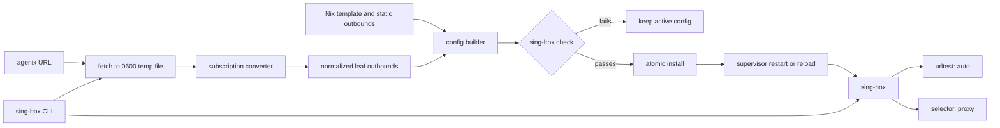

# Declarative sing-box client research and integration plan

Research updated 2026-09-04.

## Verdict

Do not adopt a full sing-box client, fork one, or write a new subscription
parser. Keep sing-box as the runtime, package
[`rainbend/sing-box-subscribe-cli`][rainbend] as a small replaceable converter,
and add a repository-owned `sing-box` command for the workflows specific to
this Nix module.

The runtime should continue to consume one assembled and validated
`/var/lib/sing-box/config.json`. Configuration fragments are useful as an
ownership model, but running sing-box directly from a fragment directory would
make lexical ordering and array-append merge semantics part of the public
configuration contract. The existing module already has a safer transaction:
assemble a temporary config, run `sing-box check`, then atomically replace the
active file.

This split keeps the responsibilities narrow:

| Owner | Data |
| --- | --- |
| Nix | TUN, DNS, route rules, logging, static outbounds, selector policy |
| agenix | Subscription URL and any manually maintained secret outbounds |
| converter | Subscription response to ordinary sing-box leaf outbounds |
| module builder | Validation, tag checks, groups, platform adjustments, atomic install |
| sing-box | Tunneling, latency tests, automatic choice, runtime selector |
| local CLI | Update, inspect, test, switch, show effective config |

Deleting the converter would leave a normal sing-box config and a small Nix
module, not a converter-specific configuration system.

## Corrections to the initial research

- `sing-box merge OUTPUT -C DIRECTORY` loads a configuration directory. `-D`
  selects the working directory and was incorrect in the earlier example.
- Directory loading only reads `*.json`, in lexical order. Objects merge
  recursively, later scalar values win, and arrays append. It is not an
  ordinary overlay mechanism.
- Generate and validate a complete candidate before replacing active data. The
  previous example replaced the subscription fragment before validation.
- `urltest` measures HTTP request latency, not sustained throughput. “Best” in
  this plan means the lowest healthy test latency within the configured
  tolerance.
- Selector changes use the Clash API. Selection persistence comes from the
  current `experimental.cache_file`; old Clash API cache fields are deprecated.
- `rainbend/sing-box-subscribe-cli` now has an Apache-2.0 `v1.0.4` release, but
  it remains a very small project. Pin it and treat it as replaceable.

## Fit with the current repository

`modules/sing-box.nix` already owns the correct runtime boundary:

1. Nix generates the non-secret configuration template.
2. A root-owned runner injects the agenix outbounds array with `jq`.
3. `sing-box check` validates the complete candidate.
4. An atomic rename installs it before sing-box starts.

The module is shared by `interplanetary` (NixOS) and `portable` (nix-darwin),
but the actual policy is duplicated between `shared/default.nix` and
`hosts/portable/default.nix`. The current secret contains the complete
outbounds array, so changing a subscribed node requires editing and rekeying
repository state. The selected endpoint IP is also duplicated in both hosts'
`routeExcludeAddresses`, which will not scale to automatic selection among
subscription nodes.

Keep `settings` as the unrestricted escape hatch. It already allows complex
hand-authored sing-box route and DNS configuration and must remain authoritative
over module defaults. Subscription support should only generate outbound leaf
nodes and two groups; it must never regenerate DNS, routing, or inbounds.

## Target runtime flow



### Generated outbound shape

For each successful subscription update, the builder should create:

- the converted subscription leaf outbounds;
- `auto`, a `urltest` containing every generated leaf tag;
- `proxy`, a `selector` containing `auto` followed by every generated leaf tag;
- `direct`, maintained by the module rather than the subscription;
- optional manually maintained extra outbounds.

`route.final` and remote DNS should continue to target `proxy`. This makes
`auto` the default selection while allowing a temporary manual choice. The
existing cache file preserves that choice across restarts. If an update removes
the selected node, sing-box should fall back to `auto`; this behavior needs one
integration check before relying on it.

The builder must reject an empty node set, duplicate tags, and collisions with
module-owned tags (`direct`, `auto`, and `proxy`). Those are persistence/input
boundary failures, not speculative validation. Do not silently rename provider
tags in the first version: visible stable names make `list` and `use` easier to
understand. Add deterministic normalization only if a real provider requires
it.

## Proposed Nix interface

Keep the freeform `settings` option and evolve the outbound source instead of
putting generated data in the Nix store:

```nix
sleroq.sing-box = {
  enable = true;

  subscription = {
    enable = true;
    urlFile = config.age.secrets.sing-box-subscription-url.path;
    updateInterval = "24h";
  };

  # Optional encrypted/manual leaf outbounds for edge cases not supplied by
  # the subscription. This replaces, rather than overloads, the old full-array
  # outboundsFile role.
  extraOutboundsFile = null;

  directDomains = [ "ru" "local" ];
  directProcessNames = [ "steam" ];
  routeExcludeAddresses = [ "10.0.0.0/8" ];

  # Full native sing-box escape hatch. Routing and DNS stay hand-authored.
  settings.route.rules = [ /* complex native rules */ ];
};
```

The exact timer type can stay internal: translate `updateInterval` to a
systemd timer on NixOS and `StartInterval` on nix-darwin. Both invoke the same
builder/update program used by the CLI. Add a randomized delay on the systemd
timer only if provider traffic spreading is actually useful; it is not needed
for correctness.

Retain the old `outboundsFile` during one migration step, then remove it after
both hosts run from a subscription. A compatibility mode that indefinitely
supports two complete competing outbound arrays would make ownership unclear.

## Local CLI UX

Install one repository-owned executable named `sing-box` only if subcommand
delegation to the real binary is unambiguous; otherwise use `sb`. The safer
initial name is `sb`:

```text
sb update              Fetch, convert, validate, install, restart/reload
sb list                Show selector members and current delay data
sb test                Trigger group delay test and print sorted results
sb use auto             Select automatic latency mode
sb use <tag>            Select one outbound through the local Clash API
sb status              Show service state, current selector, last update
sb config              Print the effective redacted config
sb check               Validate the installed effective config
```

`update` is the only command that mutates files. `use` mutates only selector
state through `PUT /proxies/proxy`; it does not edit JSON. `list`, `test`, and
`use` talk to a Clash API bound to `127.0.0.1` and never exposed on a LAN. On
these single-user hosts a local API secret adds credential handling without a
meaningful boundary; require one if the listener ever becomes non-loopback.

The effective config contains proxy credentials. `sb config` should therefore
redact credential fields by default and require an explicit root-only option to
show raw JSON. Subscription URLs must be read from a file and must not appear in
process arguments, logs, or Nix store paths.

## Cross-host policy

Create a small cross-platform profile (for example,
`shared/sing-box-client.nix`) imported by both `shared/default.nix` and
`hosts/portable/default.nix`. It should contain the common direct domains,
subscription secret declaration, update policy, and selector defaults.

Keep only real host differences at the host level:

| Common | `interplanetary` | `portable` |
| --- | --- | --- |
| subscription, groups, direct domains, CLI | Linux policy routing/firewall workarounds | IPv6 disabled, macOS process names, additional direct domains |
| native route/DNS overrides | LAN/Tailscale exclusions | LAN/VPN exclusions |
| update semantics | systemd service + timer | launchd daemon + interval |

### TUN endpoint routing must be resolved before enabling auto-selection

Official sing-box behavior says `route.auto_detect_interface = true` binds
outbound connections to the detected default NIC and prevents TUN loops on
Linux and macOS. That is the simplest intended design and is already enabled.
However, this repository explicitly records that it did not prevent the
current proxy endpoint from re-entering the TUN with the pinned Linux setup;
both hosts currently carry a hard-coded endpoint exclusion.

Do not replace that observed workaround based only on documentation. During
implementation, test multiple generated endpoints on both hosts while removing
only the endpoint `/32` exclusion:

1. confirm ordinary proxied TCP and UDP;
2. trigger `urltest`, which dials every candidate;
3. switch candidates through the selector;
4. reconnect after a network/interface change;
5. inspect routes and confirm no outer proxy connection enters the TUN.

If current sing-box passes, remove endpoint-specific exclusions and rely on
`auto_detect_interface`. If Linux still fails, extend the existing fwmark/main
table policy to generated dial-capable leaf outbounds, not to `selector` or
`urltest` groups. If macOS still fails, prefer a host-level
`route.default_interface`/`bind_interface` only when its interface is stable;
resolving every provider hostname into `/32` and `/128` exclusions is the last
resort because DNS changes would make updates fragile.

Do not re-enable Linux `auto_redirect` merely because current documentation
recommends it. The module disables it for a recorded sing-box 1.13 UDP failure;
retest that workaround separately after a package upgrade.

## Atomic update and service behavior

The update path should be one well-named script/program shared by startup,
manual updates, and timers:

1. Acquire a lock so a timer and manual update cannot overlap.
2. Read the URL secret from its root-only file and fetch to a `0600` temporary
   file.
3. Convert the local file, not a URL argument, to avoid leaking the token.
4. Normalize the converter's output and combine it with the immutable Nix
   template and optional manual outbounds.
5. Validate tag ownership and run `sing-box check` on the complete candidate.
6. Atomically install the effective config and a node manifest on the same
   filesystem.
7. Ask the platform supervisor to restart/reload sing-box.
8. Leave the last valid config running on any fetch, conversion, or validation
   failure.

Service startup must not require the provider to be online. Once bootstrapped,
it starts from the last validated effective config; the timer updates it later.
For the first migration, generate and validate the initial state explicitly
before switching the service definition. Prefer a supervisor-controlled restart
for the first version. `SIGHUP` rereads and recreates the sing-box instance, but
it has no useful transactional acknowledgement and offers little advantage
until tested with TUN route changes on both platforms.

## Tool comparison

| Project | Status and license | Decision |
| --- | --- | --- |
| [`rainbend/sing-box-subscribe-cli`][rainbend] | Go, `v1.0.4` (2026-07-02), Apache-2.0, `--only-nodes`, templates and filters; very small user/commit base | **Use, pinned**, behind a normalization boundary |
| [`cnfatal/subscription-converter`][cnfatal] | Active Go converter, broad Clash/Mihomo/provider support, caching and patches; no release or declared license | Fallback for a subscription the small converter cannot parse; do not distribute without resolving license |
| [`Toperlock/sing-box-subscribe`][toperlock] | Larger Python generator/web service, continued commits but latest release `v2.8.0` (2024-10-16), no declared license | Too much configuration ownership and operational surface |
| [`shura-v/singboxctl`][singboxctl] | MIT, `v0.5.0` (2026-08-12), macOS/Linux TUI, narrow protocol/rule support, writes its own config | Reject: it competes with hand-authored native configuration |
| [`Leadaxe/singbox-launcher`][launcher] | GUI configuration manager | Reject: wrong UX and ownership model |

Do not fork `rainbend` initially. Its output is isolated enough that replacing
the parser is cheap. Fork only for a concrete missing protocol or malformed
output that upstream declines to fix. Write our own converter only if multiple
providers expose requirements none of the existing parsers can represent; a
new parser would otherwise add significant protocol and security maintenance
for no UX benefit.

## Implementation sequence

### 1. Prove the data path

- Package a pinned `sing-box-subscribe-cli` with `buildGoModule`.
- Convert the current provider from a local root-only input file.
- Verify protocols, tags, and credentials with `sing-box check` without changing
  the running service.
- Run the endpoint-routing test above on NixOS and macOS.

**Exit:** a generated candidate works on both hosts and the loop-prevention
choice is based on observed behavior.

### 2. Refactor the module around one builder

- Extract config assembly from `serviceRunner` into one builder invoked by both
  startup and update.
- Add subscription URL, interval, optional extra-outbound, and Clash API
  options.
- Generate `auto` and `proxy` groups from converted leaf tags.
- Keep `settings` unrestricted and preserve the existing Linux-only route
  policy until its replacement is proven.

**Exit:** failed conversion/check leaves the active config untouched; startup
works from cached state without network access.

### 3. Add operator UX and automation

- Add `sb update/list/test/use/status/config/check`.
- Add loopback Clash API and selector persistence.
- Add systemd and launchd schedules that call `sb update`.
- Keep logs free of URLs and credentials.

**Exit:** the same commands and observable behavior work on both hosts.

### 4. Migrate and simplify policy

- Add an agenix subscription URL secret and bootstrap generated state.
- Move duplicated common policy into the cross-platform shared profile.
- Migrate any genuinely manual outbounds to `extraOutboundsFile`.
- Remove the old full-array `outboundsFile` and selected-endpoint literals.
- Revisit DNS and old 1.13 workarounds independently; remove only those made
  unnecessary by verified current behavior.

**Exit:** subscription renewal requires no repository edit or rebuild, manual
switching is immediate, automatic latency selection is the default, and native
sing-box configuration remains fully available for edge cases.

## Native API references

- [Configuration and directory loading][configuration]
- [URLTest outbound][urltest]
- [Selector outbound][selector]
- [Clash API][clash-api]
- [Cache file][cache-file]
- [Route interface detection][route]
- [TUN routing options][tun]

[rainbend]: https://github.com/rainbend/sing-box-subscribe-cli
[cnfatal]: https://github.com/cnfatal/subscription-converter
[toperlock]: https://github.com/Toperlock/sing-box-subscribe
[singboxctl]: https://github.com/shura-v/singboxctl
[launcher]: https://github.com/Leadaxe/singbox-launcher
[configuration]: https://sing-box.sagernet.org/configuration/
[urltest]: https://sing-box.sagernet.org/configuration/outbound/urltest/
[selector]: https://sing-box.sagernet.org/configuration/outbound/selector/
[clash-api]: https://sing-box.sagernet.org/configuration/experimental/clash-api/
[cache-file]: https://sing-box.sagernet.org/configuration/experimental/cache-file/
[route]: https://sing-box.sagernet.org/configuration/route/
[tun]: https://sing-box.sagernet.org/configuration/inbound/tun/
